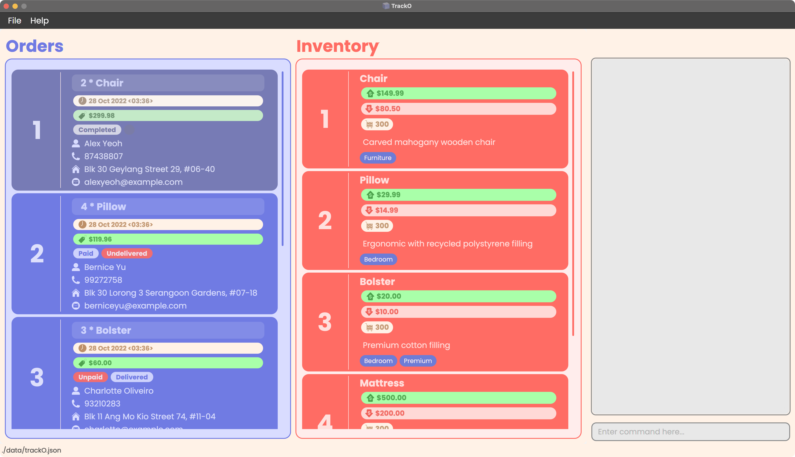

TrackO is a **desktop app built for small business owners to help them manage customer contacts and orders, optimized for use via a Command Line Interface** (CLI) while still having the benefits of a Graphical User Interface (GUI). If you prefer and are fast at typing, TrackO can get your order and inventory management tasks done faster than traditional GUI apps.

* Table of Contents
  {:toc}

--------------------------------------------------------------------------------------------------------------------

## Quick start

1. Ensure you have Java `11` or above installed in your Computer.

1. Download the latest `TrackO.jar` from [here](https://github.com/AY2223S1-CS2103T-W15-3/tp/releases).

1. Copy the file to the folder you want to use as the _home folder_ for your AddressBook.

1. Double-click the file to start the app. The GUI similar to the below should appear in a few seconds. Note how the app contains some sample data. 
   

1. Type the command in the command box and press Enter to execute it. e.g. typing **`listo`** and pressing Enter will show a lit of existing orders. 
   Some example commands you can try:

    * **`listo`** : Lists all orders.

    * **`addi`**`n/Keychain` : Adds an inventory item named `Keychain` to the inventory list.

    * **`deleteo`**`3` : Deletes the 3rd order shown in the current list.

    * **`exit`** : Exits the app.

1. Refer to the [Features](#features) below for details of each command.

--------------------------------------------------------------------------------------------------------------------

## Features

**:information_source: Notes about the command format:** 

* Words in `UPPER_CASE` are the parameters to be supplied by the user. 
  e.g. in `add n/NAME`, `NAME` is a parameter which can be used as `add n/John Doe`.

* Parameters can be in any order. 
  e.g. if the command specifies `n/NAME p/PHONE_NUMBER`, `p/PHONE_NUMBER n/NAME` is also acceptable.

* If a parameter is expected only once in the command but you specified it multiple times, only the last occurrence of the parameter will be taken. 
  e.g. if you specify `p/12341234 p/56785678`, only `p/56785678` will be taken.

* Extraneous parameters for commands that do not take in parameters (such as `list` and `exit`) will be ignored. 
  e.g. if the command specifies `list 123`, it will be interpreted as `list`.

### Adding an inventory item: `addi`

Adds an item to the list of tracked inventory.

Format: `addi n/ITEM_NAME [t/TAG]…​`

:bulb: **Tip:**
An inventory item can have any number of tags (including 0)

Examples:
* `addi n/Keychain`
* `addi n/Chair t/Furniture`

### Deleting an inventory item : `deletei`

Deletes the specified item from the list of tracked inventory.

Format: `deletei INDEX`

* Deletes the item at the specified `INDEX`.
* The index refers to the index number shown in the displayed inventory list.
* The index **must be a positive integer** 1, 2, 3, …​

Examples:
* `listi` followed by `deletei 2` deletes the 2nd item in the list of tracked inventory.

--------------------------------------------------------------------------------------------------------------------

## Command summary

Action | Format, Examples
--------|------------------
**Add Inventory** | `addi n/NAME [t/TAG]…​`   e.g., `addi n/Chair t/Furniture`
**Delete Inventory** | `deletei INDEX`  e.g., `deletei 3`
